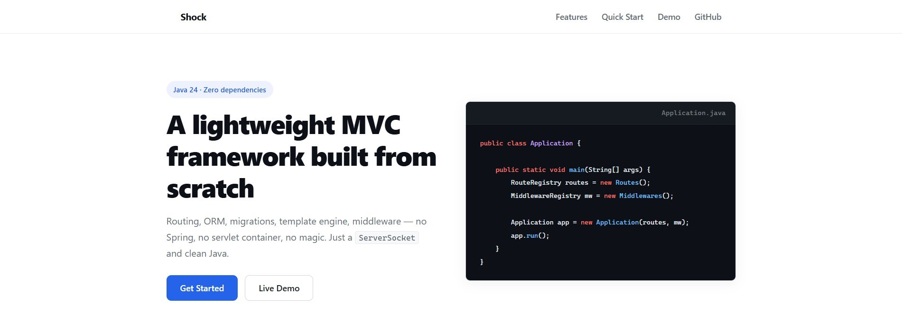

# Shock — Java MVC Web Framework

Shock is a from-scratch Java MVC framework. No servlet container, no Spring, no Netty. Raw `ServerSocket` with routing, middleware, a custom template engine, and an Active Record ORM — all in a single repo with zero required external dependencies.

## Feature Summary



- **HTTP Server**: Raw `ServerSocket` with multi-threaded request handling. Parses request line, headers, and body manually.
- **Routing**: Register `GET`, `POST`, `PUT`, `PATCH`, `DELETE` routes with method references. URI path parameters (`:id`) and query parameter parsing included.
- **Controllers**: Extend `Controller`, define static handler methods that accept `Request` and `Response`.
- **Middleware**: Global and named middleware pipeline. Apply by name to specific routes.
- **Template Engine**: Hand-written lexer and recursive descent parser. Supports `{{variable}}`, ``, ``, ``, ``, ``. Layout-based — views inject into a base template.
- **Database**: `DBConnection` with built-in connection pool, query `Builder`, `Repository`, `Mapper`, `EntityManager`, and `RelationManager`. Table/Column/Primary/BelongsTo/HasMany annotations for model mapping. Dialect-aware — supports MySQL, PostgreSQL, and SQLite.
- **Migrations**: `MigrationGenerator` creates dialect-aware CREATE TABLE SQL. `MigrationRunner` applies versioned migration files.
- **Session**: `SessionManager` with session middleware for automatic session handling.
- **MIME Types**: Built-in content type mappings via `MimeType` utility.

### Architected for Flexibility

Built around a few core components that are designed to be extended or replaced:

- `org.whilmarbitoco.core` — framework source, never depends on app code
- `org.whilmarbitoco.registry` — wire your routes and middleware here
- `org.whilmarbitoco.http` — controllers and middleware go here
- `org.whilmarbitoco.database` — models and repositories
- `src/main/resources/config.properties` — server port, DB credentials, default view template

---

## Project Structure

```
src/main/java/org/whilmarbitoco/
├── Main.java                          # Entry point
├── core/
│   ├── Application.java               # Bootstraps routes, middleware, server
│   ├── Controller.java                # Base controller
│   ├── ControllerInvoker.java         # Invokes controller methods via reflection
│   ├── http/
│   │   ├── Server.java                # Raw ServerSocket, request parsing
│   │   ├── Request.java               # URI, params, headers, body
│   │   ├── Response.java              # Status, headers, body output
│   │   ├── Middleware.java            # Interface
│   │   ├── MimeType.java              # Content-type mappings
│   │   └── StaticFileHandler.java     # Static file serving
│   ├── router/
│   │   ├── Router.java                # Route matching and resolution
│   │   ├── RouteHandler.java          # Handler metadata
│   │   └── RouteRegistry.java         # Base class for route definitions
│   ├── registry/
│   │   └── MiddlewareRegistry.java    # Global and named middleware
│   ├── view/
│   │   ├── View.java                  # Rendering + layout injection
│   │   ├── Lexer.java                 # Template tokenizer (regex-based)
│   │   ├── Parser.java                # Recursive descent parser
│   │   ├── Token.java / TokenType.java
│   │   └── node/                      # AST nodes: Text, Variable, If, For
│   ├── database/
│   │   ├── DBConnection.java          # Connection manager with built-in pool
│   │   ├── Builder.java               # Query builder
│   │   ├── Repository.java            # Generic repository
│   │   ├── Mapper.java                # ResultSet to object mapping
│   │   ├── EntityManager.java         # Entity operations
│   │   ├── RelationManager.java       # Relationship eager loading
│   │   ├── MigrationGenerator.java    # Dialect-aware migration SQL generator
│   │   ├── MigrationRunner.java       # Versioned migration runner
│   │   ├── Dialect.java               # Dialect interface
│   │   ├── MySQLDialect.java          # MySQL dialect
│   │   ├── PostgreSQLDialect.java     # PostgreSQL dialect
│   │   ├── SQLiteDialect.java         # SQLite dialect
│   │   ├── Table.java / Column.java / Primary.java / BelongsTo.java / HasMany.java
│   │   └── QueryResult.java
│   ├── session/
│   │   └── SessionManager.java
│   ├── exception/
│   │   ├── HttpException.java
│   │   ├── ExceptionHandler.java
│   │   └── DefaultExceptionHandler.java
│   └── utils/
│       ├── Config.java                # Loads config.properties
│       └── Error.java                 # Stack trace formatting
├── registry/
│   ├── Routes.java                    # Route definitions
│   └── Middlewares.java               # Middleware registrations
├── http/
│   ├── controller/
│   │   ├── IndexController.java
│   │   ├── UserController.java
│   │   └── TodoController.java
│   └── middleware/
│       ├── AuthMiddleware.java
│       ├── SessionMiddleware.java
│       └── LogsMiddleware.java
└── database/
    ├── model/
    │   ├── User.java / Todo.java / Token.java
    └── repository/
        ├── UserRepository.java / TodoRepository.java / TokenRepository.java
```

---

## Getting Started

### Prerequisites
- Java 24
- Maven 3.x
- A JDBC driver for your database (MySQL, PostgreSQL, or SQLite)

### 1. Clone
```bash
git clone https://github.com/whilmarbitoco/shock.git
cd shock
```

### 2. Configure
Edit `src/main/resources/config.properties`:
```properties
# Database — uncomment the driver profile in pom.xml for your database
db.url=jdbc:mysql://localhost:3306/mydb
db.user=root
db.password=secret
db.pool.size=5
db.debug=false

# Server
server.port=8080

# View
view.template=template.html
```

### 3. Build
```bash
# Activate the database driver profile (mysql, postgresql, or sqlite)
mvn compile -P mysql
```

### 4. Define Routes

`src/main/java/org/whilmarbitoco/registry/Routes.java`:
```java
public class Routes extends RouteRegistry {
    @Override
    public void register() {
        router.get("/", IndexController.class, "index");
        router.get("/users/:id", UserController.class, "show");
        router.patch("/users/:id", UserController.class, "update");
    }
}
```

### Register Middleware

`src/main/java/org/whilmarbitoco/registry/Middlewares.java`:
```java
public class Middlewares extends MiddlewareRegistry {
    @Override
    public void global() {
        addGlobal(new LogsMiddleware());
        addGlobal(new SessionMiddleware());
    }

    @Override
    public void register() {
        add("auth", new AuthMiddleware());
    }
}
```

### Write a Controller

```java
public class IndexController extends Controller {
    public static String index(Request request, Response response) {
        return view().render("index.html", Map.of("name", "World"));
    }
}
```

### Create a View Template

`src/main/resources/view/index.html`:
```html
<!DOCTYPE html>
<html>
<head><title>Home</title></head>
<body>
    <h1>Hello, {{name}}!</h1>
    
        <p>Welcome back.</p>
    
        <p>Please log in.</p>
    
</body>
</html>
```

The default layout (`template.html`) wraps views via `{{content}}` injection. Override with `view().template("other.html")` or pass raw HTML strings.

---

## Template Syntax

| Syntax | Description |
|--------|-------------|
| `{{variable}}` | Output a context variable |
| `` | Conditional block |
| `` | Else-if branch |
| `` | Else branch |
| `` | Close conditional |
| `` | Loop over a collection |
| `` | Rendered when the loop collection is empty |
| `` | Close loop |

---

## Configuration Reference

All keys in `config.properties`:

| Key | Default | Description |
|-----|---------|-------------|
| `db.url` | — | JDBC URL (e.g. `jdbc:mysql://localhost:3306/mydb`) |
| `db.user` | — | Database username |
| `db.password` | — | Database password |
| `db.pool.size` | `5` | Connection pool size |
| `db.debug` | `false` | Enable SQL debug logging |
| `server.port` | — | HTTP server port |
| `view.template` | — | Default layout template filename |

---

## Database Driver Profiles

Shock does not bundle a JDBC driver. Activate one via Maven profile:

| Profile | Dependency |
|---------|------------|
| `-P mysql` | MySQL Connector/J 8.3.0 |
| `-P postgresql` | PostgreSQL JDBC 42.7.3 |
| `-P sqlite` | SQLite JDBC 3.45.1.0 |

Example:
```bash
mvn test -P sqlite
```

---

## Tech Stack

- **Java 24** (Maven)
- **Zero required external dependencies** (JDBC driver activated via profile)
- No servlet container, no third-party frameworks

## Contributing

See [CONTRIBUTING.md](./CONTRIBUTING.md) for build instructions, coding conventions, and how to add new dialects or middleware.

## License

MIT — see [LICENSE](./LICENSE).
